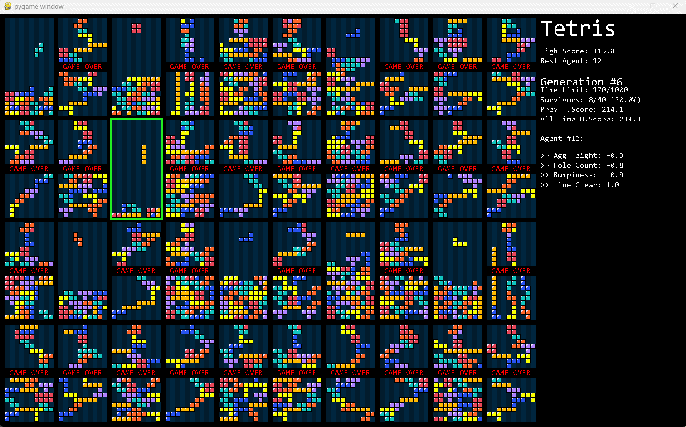

# TetrisAI
用遗传算法玩俄罗斯方块，并用图形展示训练过程


#Knowledge
遗传算法很大程度基于自然选择，简单来说，适者生存。通过一组基因（特征）来衡量个体的强弱，选出最优秀的一组，淘汰其余的，下一步是进化他们，首先让他们配对，随机混合他们的基因，以产生一群后代。希望能产生一个比他们父母表现更好个体，为了保持生物多样性，我们随机突变孩子们的基因，这么做是为了未来的基因库不会严格限制在父母的基因中。

技术上遗传算法就是在更新模型参数，对标梯度下降算法。

怎么给俄罗斯方块的AI打分？怎么从玩俄罗斯方块的策略中提取出衡量游戏好坏的指标？这里参考的是:[Tetris AI – The (Near) Perfect Bot](https://codemyroad.wordpress.com/2013/04/14/tetris-ai-the-near-perfect-player/)

这篇文章中提出了4个指标：
> * 方块累积的高度，取每列高度的总和，我们希望最小化这个值，因为较低的总高度意味着我们可以将更多的方块放入网格中。 
> * 完整行的数量，我们希望最大化完整行的数量，因为清除线是人工智能的目标。
> * 累积的方块中的空格，这些空格很难清除，必须尽量减少这些空格
> * 平滑度，盘面累积的方块越凹凸不平，越难消除

具体实现细节可以参考源码，源码中有详细的注释。

# Prerequisites
项目只依赖pygame
```
pip install -r requirements.txt
```

# Run
cd /path/to/TetrisAI/folder/
```
pip install -r requirements.txt
python main.py
```

# Configurations
1. 族群的数量，配置想是config.py里ROW_COUNT(多少行数)和COL_COUNT(一行有多少个游戏或AI)
2. 每个游戏的显示区域大小，配置项是config.py里的GAME_WIDTH(单个游戏的宽度)，游戏高度默认设置为两倍宽度
3. 基因突变的概率，配置项是config.py里的MUTATION_RATE，较大的突变率变化的更快，可能会学的更快，也可能因为’太猛‘了而导致效果更差
